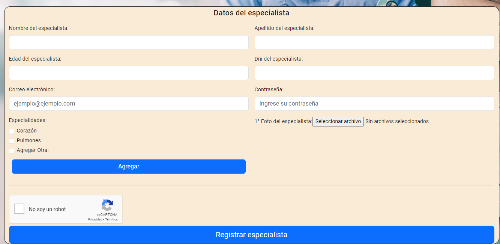

<h1 align="center"> :computer: 2023 - 2do cuatrimestre - Laboratorio 4 :computer: </h1> 
<h1 align="center"> TP - FINAL Clinica OnLine </h1> 

**Deploy en Firebase:** [Ir a Clinica OnLine](tp-clinica-labiv.web.app/)

 
 

## Idea del proyecto

En este Tp se busca dise una app que simule la actividad de una clinica online, siguiendo:

<i>"La clínica OnLine, especialista en salud, cuenta actualmente con consultorios (6 en la actualidad), dos laboratorios (físicos en la clínica), y una sala de espera general. Está abierta al público de lunes a viernes en el horario de 8:00 a 19:00, y los sábados en el horario de 8:00 a 14:00.
Trabajan en ella profesionales de diversas especialidades, que ocupan los consultorios acorde a su disponibilidad, y reciben en ellos pacientes con turno para consulta o tratamiento. Dichos turnos son pedidos por la web seleccionando el profesional o la especialidad. La duración mínima de un turno es 30 minutos. 
Los profesionales pueden cambiar la duración según su especialidad. Estos profesionales pueden tener más de una especialidad.
También contamos con un sector dentro de la clínica que se encarga de la organización y administración de la misma."
</i>

## Guia de usuario

En primer lugar te encontraras con una pagina de bienvenida donde se encuentra el logo de la clinica y un slogan. En la parte inferior del slogan se observas dos opciones: un Inicio de sesion y un Registro donde podras registrate.

## Registro

En esta sección podrás registrarte como paciente o especialista.

## Paciente - Registro

Se piden los datos necesarios para integrar un paciente al sistema, este debe agregar 2 fotos

## Especialista - Registro

Se piden los datos necesarios para integrar un especialista al sistema, este debe agregar una foto y seleccionar sus especialidades. Si estas no existen, podrá agregarlas individualmente. 

## Inicio sesión

Aca se ingresa el mail y contraseña, ademas tenemos accesos rapidos a diferentes cuentas.

## Solicitar Turno

Comienza mostrando los profesionales, en botones redondos, con la imagen del mismo y su nombre arriba del botón.

Una vez seleccionado mostrará las especialidades, en botones cuadrados con bordes redondeados, con la imagen de la especialidad. En caso de no tener muestra imagen por default.

Una vez seleccionada la especialidad, aparecerán los días con turnos disponibles para ese PROFESIONAL. Estos botones deben ser rectangulares. Formato (2021-09-09).
Seleccionado el día mostrará los horarios disponibles. Estos botones deben ser cuadrados con bordes redondeados. Formato 13:15.

Una vez seleccionado todo lo necesario, podrás reservar el turno con el botón "Registrar turno" abajo de la pantalla. 

## Mis Turnos

Se muestran todos los turnos permitiendo buscar por todos los campos del mismo, dia, hora, especialista, especialidad, etc. Tambien en caso de ser paciente se pueden cancelar, calificar, ver reseña/comentario y completar una encuesta, y en el caso de ser especialista se puede aceptar o rechazar, una vez aceptado se puede cancelar, finalizar, una vez que el turno finaliza el especialista debera completar la historia clinica y dar una reseña.

## Mi Perfil

Podremos ver los datos del usuario conectado. Adicionalmente, si es un paciente, podremos acceder a la historia clinica y en el caso de los especialistas a los horarios de estos.

### Paciente

### Especialista

## Historia Clinica

Se ven las historias clinicas del paciente permitiendo descargar la informacion en formato pdf. En el caso del adminsitrador podra descargar las historias clinicas en formato xlsx (excel).

## :sunglasses: Administracion (Admin) :sunglasses:

Aqui podra acceder el administrador, puede ejecutar acciones como:

### Listar Turnos

Veras todos los turnos que hubo

### Añadir Turno

Podrá registrar un nuevo turno seleccionando Especialista y Paciente

### Usuarios

Se podra habilitar/deshabilitar especialistas en el sistema

Podrá agregar un nuevo administrador en categoría Administradores

### Añadir Admin

Sólo aqui se podra registrar usuarios de tipo Administrador

## 	:woman_health_worker: Especialista :man_health_worker:

### Mis Turnos

Verás los turnos que tienes o tenías disponible

### Pacientes 

Verás la historia clinica de los pacientes que en algún momento tuviste

### Comentarios

Verás los comentarios que recibiste por parte de los pacientes

## :mask: Pacientes :sneezing_face:

### Mis Turnos

Verás los turnos que tienes o tenías disponible

### Añadir Turno

Podrás generar un nuevo turno

### Comentarios

Verás los comentarios de todos los Especialistas
